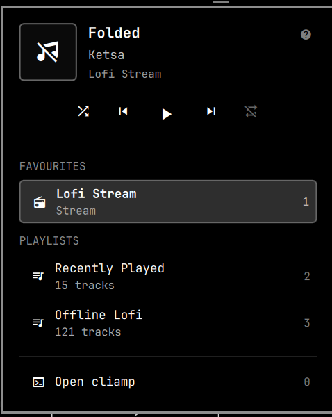
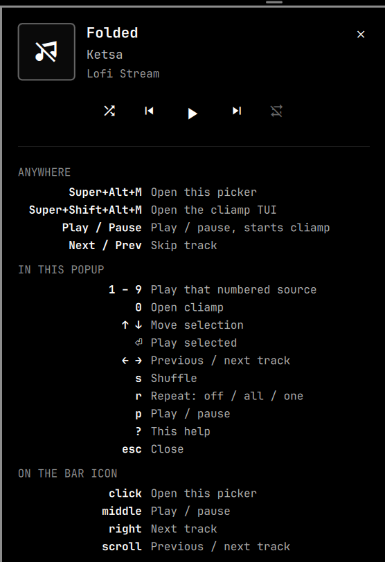

# barclamp

Control [cliamp](https://github.com/bjarneo/cliamp) from the
[Omarchy](https://omarchy.org/) bar. One icon, a picker for your favourite
streams and playlists, and media keys that work.

*A bar clamp holds things in place. This one holds cliamp in your bar.*



## Why

cliamp is a terminal player, so controlling it means finding its window. This
puts playback state in the bar, transport on your media keys, and your
favourite streams one keystroke away — while cliamp itself stays stashed on a
scratchpad workspace, or closed entirely until you want it.

## What you get

One icon in the bar's right section:

| Icon | Meaning |
|:---:|---|
| `▶` bright | Playing |
| `⏸` dimmed | Paused |
| `♫` dimmed | cliamp is not running |

The icon is **always present**, unlike a now-playing widget that hides when
nothing is on. It is how you *start* music, not just how you control it.

| Input on the icon | Action |
|---|---|
| Left click | Open / close the picker |
| Middle click | Play / pause |
| Right click | Next track |
| Scroll | Previous / next track |
| Hover | Tooltip with `Title — Artist` |

The popup carries the current track, transport (shuffle, previous,
play/pause, next, repeat), and every favourite stream and local playlist.
Selecting one switches to it immediately.

## Keyboard

`SUPER + ALT + M` opens the picker **with keyboard focus**, so a source can be
chosen without touching the mouse.

| Key | Action |
|---|---|
| `1` – `9` | Play that numbered source directly |
| `0` | Open cliamp |
| `↑` `↓` (or `k` `j`) | Move the cursor. The first press reveals it without moving |
| `Enter` / `Space` | Play the selected source |
| `←` `→` | Previous / next track |
| `s` | Toggle shuffle |
| `r` | Cycle repeat: Off → All → One |
| `p` | Play / pause |
| `?` | Show every shortcut, including the global ones |
| `Esc` | Close the shortcut list, or the popup |

Every row in the picker carries its key on the right, so `1` plays the first
favourite, `2` the next row down, and so on through favourites and playlists.

"Open cliamp" is always `0`. It is a fixed action rather than a source, so it
keeps a key of its own instead of shifting every time a favourite is added or
a playlist appears.

Two highlights mean different things and can appear at once: a **filled** row
is the source you are listening to, an **outlined** row is where the keyboard
cursor sits. Reaching for the mouse retires the keyboard cursor, so only one
selection is ever showing.



## Requirements

- [Omarchy](https://omarchy.org/) 4.x (Quickshell-based shell, `omarchy-shell`)
- [cliamp](https://github.com/bjarneo/cliamp) 2.x
- `jq` and `python3` (both already present on a stock Omarchy install)

## Install

```bash
omarchy plugin add https://github.com/Satal/barclamp.git
omarchy plugin enable satal.cliamp --section right
```

Then put the helper on your `PATH` — the plugin installer deliberately only
clones files, so this step is yours:

```bash
ln -s ~/.config/omarchy/plugins/satal.cliamp/bin/omarchy-cliamp ~/.local/bin/
```

Finally append the keybindings from
[`hypr/bindings.example.lua`](hypr/bindings.example.lua) to
`~/.config/hypr/bindings.lua`, and reload:

```bash
hyprctl reload
```

To place the icon somewhere specific:

```bash
omarchy bar move satal.cliamp --before omarchy.audio
```

## Keeping cliamp off your screen

cliamp's window **is** the player — the TUI and the audio are one process, so
closing the window stops the music. It can be hidden, though. Park it on
Omarchy's scratchpad and it keeps playing while taking no screen space:

```lua
-- ~/.config/hypr/hyprland.lua
o.window({ class = "^org\\.omarchy\\.cliamp$" }, { workspace = "special:scratchpad silent" })
```

`silent` matters: without it, launching cliamp drags you onto the special
workspace. With it, cliamp starts hidden and you stay where you were.

`SUPER + S` (Omarchy's stock binding) brings it up when you want to look at
it, and hides it again. "Open cliamp" in the picker does the same thing.

Note that a window on a special workspace does not appear merely because it
was focused, which is why the helper toggles the workspace rather than
calling `omarchy-launch-or-focus-tui`.

## Offline music

cliamp playlists can reference a **directory** rather than a fixed list of
files, so anything you add later appears with no reconfiguring:

```bash
cliamp playlist create "Offline Lofi" --dir ~/Music
```

That playlist then shows up in the picker. For Creative Commons music to fill
it with, [Dusted Wax Kingdom](https://archive.org/details/dustedwaxkingdom)
(lo-fi hip hop) and the [Free Music Archive](https://freemusicarchive.org/genre/Lo-fi)
are good starting points.

## How it works

Playback state and transport go over **MPRIS**, which cliamp publishes as
`org.mpris.MediaPlayer2.cliamp` with an `Identity` of `"Cliamp"`. That is
unambiguous — unlike a browser, which calls itself `"Chrome"` whatever it
happens to be playing — so the plugin needs no guesswork to know what it is
controlling. MPRIS is reactive, so nothing is polled.

`bin/omarchy-cliamp` covers what MPRIS cannot express: listing sources,
switching source, shuffle and repeat, and starting cliamp when there is
nothing on the bus to talk to.

### Switching source

There is no MPRIS route for "play this one thing" — cliamp implements no
`OpenUri` and reports no supported URI schemes. The obvious CLI routes are all
wrong too:

| Approach | Why it fails |
|---|---|
| `cliamp queue <url>` | Appends to the **end** of the queue; the current track keeps playing |
| `queue` then `next` | `next` steps forward exactly one track, landing on the wrong one |
| `playlist create` from a URL | Stats the URL as a file path and refuses |

What works is cliamp's **v2 IPC API**: `queue.clear` followed by `url.load`
with `play: true`. Clearing first matters because `url.load` appends —
picking a source from the bar means "play this now", not "add this to the
queue".

### Favourites and playlists

Favourites are read from `~/.config/cliamp/favorites.toml` rather than
`cliamp playlist list`, because the file carries the stream URL and the
realtime flag that the list output drops. The file is watched, so favouriting
a stream inside the TUI updates the picker immediately.

The station name is not in the MPRIS metadata, so it is recovered by matching
the playing `xesam:url` against the favourites list — cheaper and more
reactive than polling `cliamp status --json` on a timer.

### Shuffle and repeat

cliamp's MPRIS interface errors on `Shuffle` and `LoopStatus` (Input/output
error), so neither state nor control goes through MPRIS. Both use
`cliamp shuffle` / `cliamp repeat`, read back from `cliamp status --json`,
refreshed when the popup opens and after a toggle rather than polled.

### Keyboard focus

The popup is a `KeyboardPanel` (layer shell) rather than a `PopupCard`
(xdg-popup). An xdg-popup only receives keys after a click or hover routes
focus through its parent surface, so a keyboard-summoned picker would get no
keys at all.

## Known quirks

**Skip sometimes does nothing.** cliamp reports `CanGoNext: true`
unconditionally, so the skip buttons always look enabled. They genuinely have
nowhere to go when a radio **stream** is playing (a stream has no track list)
or when the loaded playlist holds a single track. That is cliamp's behaviour,
not a broken binding.

**The helper needs to be on `PATH`.** `omarchy plugin add` clones files and
nothing else — by design, it never runs install hooks or sudo — so the symlink
in the install steps above is not optional.

## Layout

| File | Role |
|---|---|
| `Service.qml` | MPRIS state, source loading, the `cliamp` IPC target |
| `Widget.qml` | The bar icon, the picker popup, and the shortcut list |
| `SourceRow.qml` | One row of the picker |
| `bin/omarchy-cliamp` | Source listing, source switching, shuffle/repeat, starting cliamp |

The service is a separate `service` kind because a bar widget is instantiated
once per monitor, and an `IpcHandler` must be registered exactly once.

## IPC

```bash
omarchy-shell cliamp status      # JSON: title, artist, station, url, modes, counts
omarchy-shell cliamp playPause
omarchy-shell cliamp next
omarchy-shell cliamp previous
omarchy-shell cliamp shuffle     # toggle
omarchy-shell cliamp repeat      # cycle
omarchy-shell cliamp show        # toggle the picker
omarchy-shell cliamp window      # open/focus the cliamp TUI
omarchy-shell cliamp refresh     # re-read favourites, playlists and modes
```

Helper failures are logged to `~/.local/state/omarchy/cliamp.log`.

## Licence

MIT — see [LICENSE](LICENSE).
